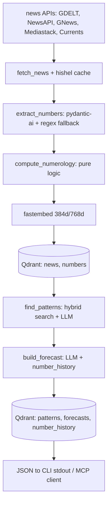

# Architecture

> **Phase 0 template.** The layer map, the boundary rules and the state model below are settled;
> the data-flow diagram describes the *target* pipeline and is filled in as its steps land
> (phases 2–5). The full document is written in phase 10.1.

## One pipeline, two interfaces

numenews is a single package with two entry points over the same code:

- **MCP server** (`numenews.mcp`, phase 6) — nine tools an LLM client calls, each returning a
  Pydantic model.
- **One-shot CLI** (`numenews.cli`, phase 7) — the same operations once per invocation, JSON on
  stdout, nothing else.

Both are thin: the work lives in the pipeline, and all persistent state lives in Qdrant, so a
command must be idempotent and resumable (AGENTS.md).

## Layers

| Layer | Package | May import | Responsibility |
|---|---|---|---|
| Pure logic | `numerology` | nothing | reduction, master numbers, gematria, date resonance, regex fallback |
| Boundaries | `models` | nothing | Pydantic v2 types crossing every module boundary |
| Adapters | `news`, `embeddings` | `models` | five news APIs behind one Protocol; local `fastembed` vectors |
| Storage | `vector` | `models` | Qdrant client, collections, payload indexes, hybrid search |
| Reasoning | `agents` | `numerology`, `models` | `pydantic-ai` agents: extract, pattern, forecast |
| Interfaces | `mcp`, `cli` | everything above | tool and command surfaces, JSON serialization |

Two rules keep this acyclic and testable:

1. `numerology` is pure — no I/O, and never imports `news`, `vector`, `agents` or `mcp`, so its
   invariants can be property-tested without any infrastructure.
2. State crosses boundaries as Pydantic models only — no dicts, no dataclasses, no free-form JSON
   from an LLM.

`config` and `logging` sit below every layer: settings are validated once at start, and logs go to
stderr so stdout stays machine-readable.

## Data flow (target)

Context management: a sliding seven-day window feeds the agents, older items are summarised into a
numerological digest, and `number_history` carries activations across sessions.

## State

| Collection | Vector | Payload indexes |
|---|---|---|
| `news` | 768d (`bge-base-en-v1.5`) | `date`, `source`, `numerology_value`, `master_number` |
| `numbers` | 384d (`bge-small-en-v1.5`) | `number`, `context` |
| `patterns` | 768d | `type`, `strength`, `discovered_at` |
| `forecasts` | 768d | `date`, `dominant_number` |
| `number_history` | — (payload only) | `number`, `date` |

Payload indexes are created **before** ingest: with an index Qdrant pre-filters inside the HNSW
walk, without one it degrades to post-filtering. In multi-stage (hybrid) queries the filter belongs
inside each `Prefetch`.

## Implemented so far

Phase 0 only: configuration (`config.py`), logging (`logging.py`), the package skeleton and the
test scaffolding. `ROADMAP.md` is the authoritative status; `docs/adr/` records the decisions.
