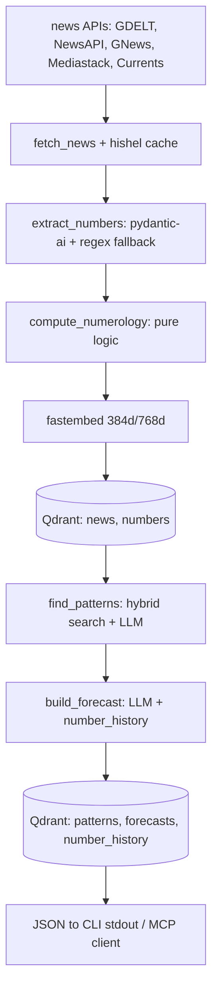

# Architecture

> **Phase 0 template.** The layer map, the boundary rules and the state model below are settled;
> the data-flow diagram describes the *target* pipeline and is filled in as its steps land
> (phases 2–5, of which 2, 3 and 4 are done). The full document is written in phase 10.1.

## One pipeline, two interfaces

numenews is a single package with two entry points over the same code:

- **MCP server** (`numenews.mcp`, phase 6) — nine tools an LLM client calls, each returning a
  Pydantic model.
- **One-shot CLI** (`numenews.cli`, phase 7) — the same operations once per invocation, JSON on
  stdout, nothing else.

Both are thin: the work lives in the pipeline, and all persistent state lives in Qdrant, so a
command must be idempotent and resumable (AGENTS.md).

## Layers

| Layer | Package | May import | Responsibility |
|---|---|---|---|
| Pure logic | `numerology` | `models` | reduction, master numbers, gematria, date resonance, regex fallback |
| Boundaries | `models` | nothing | Pydantic v2 types crossing every module boundary |
| Adapters | `news`, `embeddings` | `models` | five news APIs behind one Protocol; local `fastembed` vectors |
| Storage | `vector` | `models`, `embeddings`, `numerology` | Qdrant client, collections, payload indexes, hybrid search |
| Reasoning | `agents` | `numerology`, `models` | `pydantic-ai` agents: extract, pattern, forecast |
| Interfaces | `mcp`, `cli` | everything above | tool and command surfaces, JSON serialization |

Two rules keep this acyclic and testable:

1. `numerology` is pure — no I/O, and never imports `news`, `vector`, `agents` or `mcp`; it depends
   only on `models` for the types of its results (ADR 0002), so its invariants can be property-tested
   without any infrastructure.
2. State crosses boundaries as Pydantic models only — no dicts, no dataclasses, no free-form JSON
   from an LLM.

`vector` is the one layer that reads two others: `embeddings` for the `Embedder` Protocol its
collections embed with, and `numerology` for `is_master`, which derives the filterable
`master_number` payload field. Both are leaves, so the graph stays acyclic and 11/22/33 stays defined
once (ADR 0003).

`config` and `logging` sit below every layer: settings are validated once at start, and logs go to
stderr so stdout stays machine-readable.

## Data flow (target)

Context management: a sliding seven-day window feeds the agents, older items are summarised into a
numerological digest, and `number_history` carries activations across sessions.

## State

| Collection | Vector | Payload indexes |
|---|---|---|
| `news` | 768d (`bge-base-en-v1.5`) | `date`, `source`, `numerology_value`, `master_number` |
| `numbers` | 384d (`bge-small-en-v1.5`) | `number`, `context` |
| `patterns` | 768d | `type`, `strength`, `discovered_at` |
| `forecasts` | 768d | `date`, `dominant_number` |
| `number_history` | — (payload only) | `number`, `date` |

Payload indexes are created **before** ingest: with an index Qdrant pre-filters inside the HNSW
walk, without one it degrades to post-filtering. In multi-stage (hybrid) queries the filter belongs
inside each `Prefetch`.

A `date` payload field holds the RFC 3339 start of the day (`2026-09-21T00:00:00Z`), because the
`datetime` index accepts nothing shorter; `vector/payloads.py` writes that shape and reads it back
as the domain models' `date`. `docs/QDRANT_COLLECTIONS.md` documents every payload field.

## Implemented so far

Phase 0: configuration (`config.py`), logging (`logging.py`), the package skeleton and the test
scaffolding. Phase 1: the domain models (`models/`, frozen and strict) and the pure numerology layer
(`numerology/`, 100% covered) with `docs/NUMEROLOGY.md` and ADR 0002. Phase 2: the news layer
(`news/`, 100% covered) — one `NewsSource` Protocol, five adapters (GDELT, NewsAPI, GNews,
Mediastack, Currents), one `hishel`-cached `httpx` client with a `tenacity` retry policy, and
`fetch_news` as the aggregating entry point, documented in `docs/NEWS_SOURCES.md`. Phase 3: the
vector layer — `embeddings/` wraps the two local `bge` models behind an `Embedder` Protocol
(downloaded once into `.cache/fastembed`, never at import), and `vector/` owns the Qdrant connection,
the five collections with their payload indexes, the model↔payload conversion and the four search
paths (`search_news`, `hybrid_search_news`, `find_similar_patterns`, `get_history`), documented in
`docs/QDRANT_COLLECTIONS.md` and `docs/EMBEDDINGS.md` with ADR 0003. Phase 4: the reasoning layer —
`agents/` builds any OpenAI-compatible chat model from `Settings`, runs the three `pydantic-ai`
agents (`ExtractNumbersAgent` with its regex fallback, `PatternAgent`, `ForecastAgent`), and turns
each model answer into a domain model through the draft schemas of `agents/schemas.py`; the prompts
and the `agents/` tests are documented in `docs/PROMPTS.md` with ADR 0004. `ROADMAP.md` is the
authoritative status; `docs/adr/` records the decisions.
