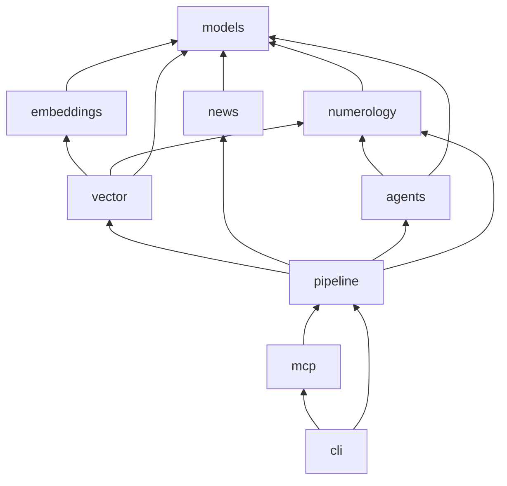
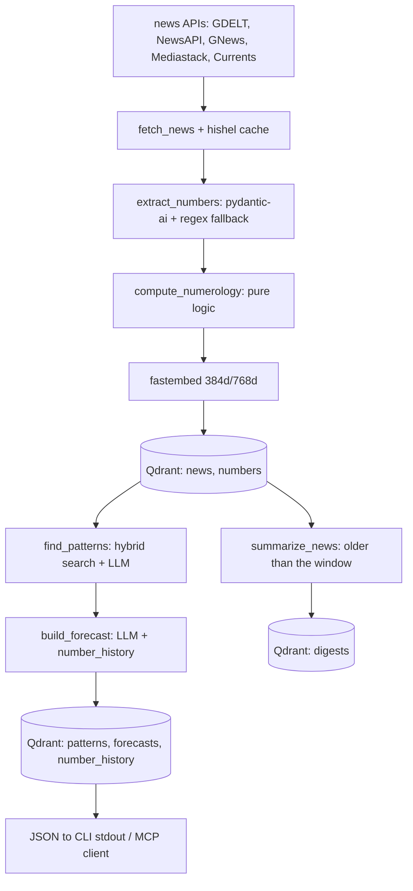
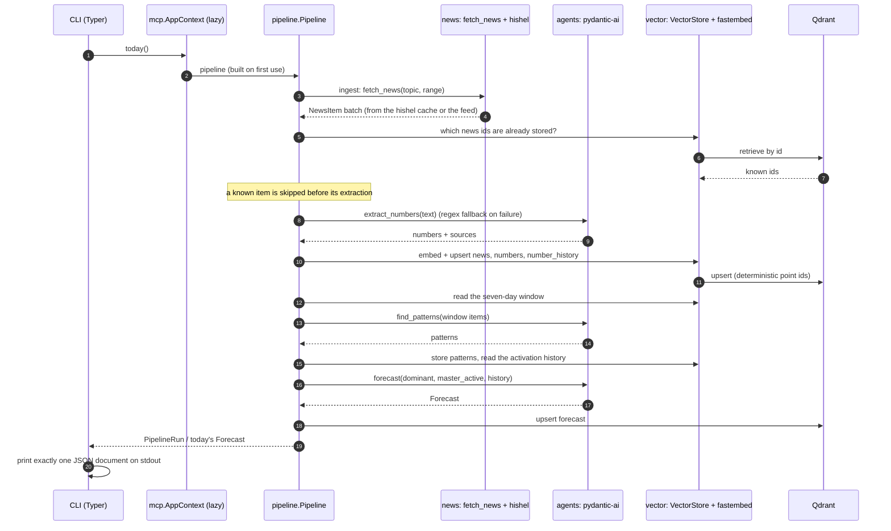
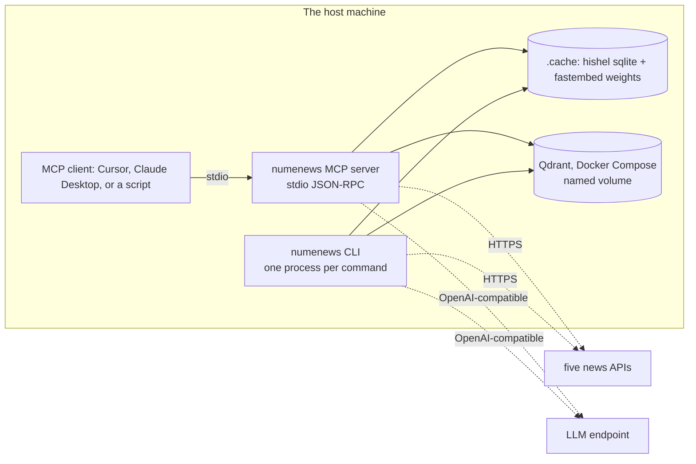

# Architecture

> `ROADMAP.md` is the authoritative status; this document describes the shape the code has. The
> reasoning behind each significant choice is in [`docs/adr/`](adr/), and the phase that introduced a
> layer is named where it matters.

## One pipeline, two interfaces, one measurement

numenews is a single package with two entry points over the same code, plus an offline measurement of
the retrieval it performs:

- **MCP server** (`numenews.mcp`, phase 6) — nine tools an LLM client calls, each returning a
  Pydantic model ([`MCP_TOOLS.md`](MCP_TOOLS.md)).
- **One-shot CLI** (`numenews.cli`, phase 7) — the same operations once per invocation, one JSON
  document on stdout and nothing else ([`USER_FLOW.md`](USER_FLOW.md)).
- **Evaluation** (`tests/eval`, phase 9) — the production retrieval path and a ragas scoring of it,
  in an isolated environment ([`EVAL.md`](EVAL.md), [ADR 0013](adr/0013-eval-isolation.md)).

The two interfaces are thin: the work lives in `numenews.pipeline`, and all persistent state lives in
Qdrant, so every command is idempotent and resumable (`AGENTS.md`).

## Layers

| Layer | Package | May import | Responsibility |
|---|---|---|---|
| Pure logic | `numerology` | `models` | reduction, master numbers, gematria, date resonance, dominant number, regex fallback |
| Boundaries | `models` | nothing | Pydantic v2 types crossing every module boundary |
| Adapters | `news`, `embeddings` | `models` | five news APIs behind one Protocol; local `fastembed` vectors |
| Storage | `vector` | `models`, `embeddings`, `numerology` | Qdrant client, collections, payload indexes, hybrid search |
| Reasoning | `agents` | `numerology`, `models` | `pydantic-ai` agents: extract, pattern, forecast, summarize |
| Composition | `pipeline` | everything above | the RAG chain, the sliding window, step timing and retries |
| Interfaces | `mcp`, `cli` | everything above; `cli` also uses `mcp` | tool and command surfaces, JSON serialization |

`config` and `logging` sit below every layer: settings are validated once at start, and logs go to
stderr so stdout stays machine-readable.



(`config` and `logging` are omitted from the graph: every layer may read settings and write a log
line, and neither imports anything but the standard library and its own dependencies.)

Two rules keep this acyclic and testable:

1. `numerology` is pure — no I/O, and never imports `news`, `vector`, `agents`, `pipeline` or `mcp`;
   it depends only on `models` for the types of its results (ADR 0002), so its invariants can be
   property-tested without any infrastructure. `tests/unit/test_numerology_api.py` asserts the rule
   in a subprocess.
2. State crosses boundaries as Pydantic models only — no dicts, no dataclasses, no free-form JSON
   from an LLM.

`vector` is the one layer that reads two others: `embeddings` for the `Embedder` Protocol its
collections embed with, and `numerology` for `is_master`, which derives the filterable
`master_number` payload field. Both are leaves, so the graph stays acyclic and 11/22/33 stays defined
once (ADR 0003).

`pipeline` is the one layer that reads all of them, which is what makes the interfaces thin: it owns
the order of the chain and nothing else — no numerology, no storage schema, no HTTP — and it is
asynchronous while `vector` stays synchronous, bridged only by `asyncio.to_thread` (ADR 0011).

`cli` is the one interface that imports the other: roadmap 7.8's `numenews mcp` proxies into
`numenews.mcp.main`, and the one-shot commands share the MCP server's lazy `AppContext` as their
container instead of growing a second one — the two surfaces build the store, the agents and the news
client the same way, once (ADR 0006).

## Data flow



The evaluation measures the retrieval half of that chain offline, against a committed corpus, without
touching the news APIs:

```mermaid
flowchart LR
    fixtures[tests/eval/fixtures<br/>news.jsonl + questions.jsonl] --> mem[Qdrant :memory: + real fastembed]
    mem --> hybrid[hybrid_search_news<br/>the production path]
    hybrid --> hit[hit@5 >= 0.8]
    hybrid --> ragas[ragas metrics in .venv-eval<br/>faithfulness, precision, recall, relevancy]
```

All of it is driven by `numenews.pipeline`, which is the only layer that knows this order. Context
management: a sliding seven-day window feeds the agents, their reading may cite the last thirty days
of number activations from `number_history`, older items are summarised into a numerological digest,
and that log carries activations across sessions — see [`CONTEXT_MANAGEMENT.md`](CONTEXT_MANAGEMENT.md).

## One `numenews today` run



## Runtime topology



Nothing is connected at startup: each MCP tool and each CLI command builds what it needs on first use,
and an unavailable prerequisite becomes an actionable error rather than a crash at launch. Embeddings
never leave the machine.

## State

| Collection | Vector | Payload indexes |
|---|---|---|
| `news` | 768d (`bge-base-en-v1.5`) | `date`, `source`, `numerology_value`, `master_number` |
| `numbers` | 384d (`bge-small-en-v1.5`) | `number`, `context` |
| `patterns` | 768d | `type`, `strength`, `discovered_at` |
| `forecasts` | 768d | `date`, `dominant_number` |
| `number_history` | — (payload only) | `number`, `date` |
| `digests` | 768d | `period_start`, `period_end` |

Payload indexes are created **before** ingest: with an index Qdrant pre-filters inside the HNSW
walk, without one it degrades to post-filtering. In multi-stage (hybrid) queries the filter belongs
inside each `Prefetch` ([ADR 0007](adr/0007-qdrant-hybrid-search.md)).

A `date` payload field holds the RFC 3339 start of the day (`2026-09-21T00:00:00Z`), because the
`datetime` index accepts nothing shorter; `vector/payloads.py` writes that shape and reads it back
as the domain models' `date`. [`QDRANT_COLLECTIONS.md`](QDRANT_COLLECTIONS.md) documents every
payload field.

## Failure and degradation

| Failure | What happens |
|---|---|
| One news source fails | The aggregator keeps the feeds that answered and logs a warning |
| Every feed is unconfigured | `NewsSourceError` — a configuration error, not a quiet empty run |
| The extract model fails | `ExtractNumbersAgent` falls back to the regex pass, so ingest still works |
| The pattern or forecast model fails | One retry, then `PipelineRetryError` naming the step; nothing is fabricated |
| Qdrant is unreachable | The store's health check fails before the first step, naming `make dev` |
| An MCP tool is misused | The SDK rejects the argument, or the tool returns a readable `ToolError` |

The full contract, per command and per tool, is in [`USER_FLOW.md`](USER_FLOW.md) and
[`MCP_TOOLS.md`](MCP_TOOLS.md).

## Implemented so far

Phase 0: configuration, logging and the test scaffolding. Phase 1: the frozen domain models and the
pure numerology layer (100 % covered) with ADR 0002. Phase 2: the news layer — one `NewsSource`
Protocol, five adapters, one `hishel`-cached retrying client, `fetch_news` as the aggregating entry
point, with ADR 0009. Phase 3: the vector layer — the two local `bge` models behind an `Embedder`
Protocol, the Qdrant connection, six collections with their payload indexes, model↔payload
conversion and the search paths, with ADR 0003, 0007 and 0008. Phase 4: the reasoning layer — four
`pydantic-ai` agents (`ExtractNumbersAgent` with its regex fallback, `PatternAgent`, `ForecastAgent`,
`SummarizeAgent`) and the draft schemas that turn a model answer into a domain model, with
ADR 0004. Phase 5: the composition layer — `ingest → analyze → forecast`, the sliding window, the
step timings, the opt-in `summarize`, and the `digests` collection, with ADR 0011. Phase 6: the MCP
server — nine tools over stdio around a lazily built `AppContext`, with ADR 0010. Phase 7: the
one-shot CLI — six commands, JSON-only stdout, an `ErrorReport` for expected failures, sharing the
MCP container, with ADR 0005 and 0006. Phase 8: long-term memory — `number_history` written on every
ingest, `activation_frequency` for the per-day series, and the thirty-day memory window in the
forecast, with ADR 0012. Phase 9: the ragas evaluation over the production retrieval path, isolated
in `.venv-eval`, with ADR 0013.

The layer-by-layer detail lives in the topic documents linked above; `ROADMAP.md` is the
authoritative status, and [`docs/adr/`](adr/) records every decision with its reason.

## Documentation map

| Question | Document |
|---|---|
| What is built, in what order? | [`ROADMAP.md`](../ROADMAP.md) |
| What do the numbers mean? | [`NUMEROLOGY.md`](NUMEROLOGY.md) |
| Which feeds, and how are they queried? | [`NEWS_SOURCES.md`](NEWS_SOURCES.md) |
| Which collections and payloads? | [`QDRANT_COLLECTIONS.md`](QDRANT_COLLECTIONS.md) |
| Which models embed what? | [`EMBEDDINGS.md`](EMBEDDINGS.md) |
| What exactly do the prompts say? | [`PROMPTS.md`](PROMPTS.md) |
| How does the chain run and degrade? | [`RAG_PIPELINE.md`](RAG_PIPELINE.md) |
| How much of the past does a prompt see? | [`CONTEXT_MANAGEMENT.md`](CONTEXT_MANAGEMENT.md) |
| Which tools, with which arguments? | [`MCP_TOOLS.md`](MCP_TOOLS.md) |
| Which commands, with which JSON? | [`USER_FLOW.md`](USER_FLOW.md) |
| How is quality measured? | [`EVAL.md`](EVAL.md) |
| How are tests organised? | [`TESTING.md`](TESTING.md) |
| Why each tool? | [`STACK.md`](STACK.md) |
