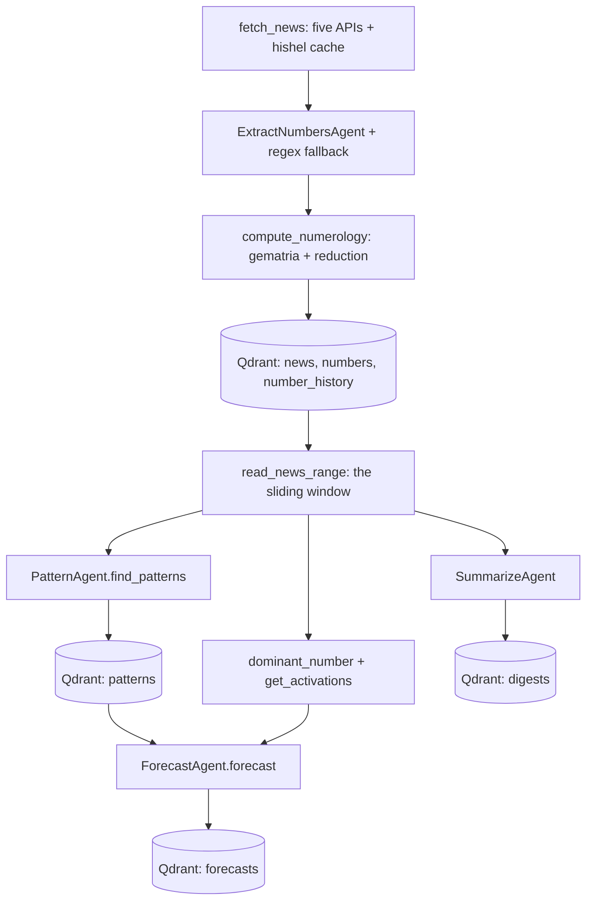

# The RAG pipeline

> Phase 5. `ROADMAP.md` is the authoritative status; this document records what the pipeline actually
> does and why. The decisions behind it are in [ADR 0011](adr/0011-rag-pipeline-orchestration.md).

The four layers below the pipeline are deliberately independent: `news` knows nothing of `agents`,
`agents` nothing of `vector`, `numerology` nothing of either. `numenews.pipeline` is the one place
that knows the order of the chain, and it owns no state of its own — everything a run remembers is in
Qdrant, so a one-shot command is idempotent and resumable (`AGENTS.md`).

## The chain



## The API

```python
from numenews.pipeline import Pipeline

with Pipeline() as pipeline:  # or Pipeline(store=..., clock=..., history_days=...)
    run = await pipeline.ingest(Topic(query="politics"), DateRange(start, end))
    analysis = await pipeline.analyze(tuple(item.id for item in run.news))
    reading = await pipeline.forecast(date(2026, 9, 21))
    digest = await pipeline.summarize(Topic(query="politics"), DateRange(start, end))
```

| Call | Steps | Writes |
|---|---|---|
| `Pipeline.ingest(topic, date_range)` | `news` → `extract` → `compute` → `embed` | `news`, `numbers`, `number_history` |
| `Pipeline.analyze(news_ids)` | `find` → `store` | `patterns` |
| `Pipeline.forecast(day)` | `forecast` (cache) → `window` → `find`/`store` → `write` | `patterns`, `forecasts` |
| `Pipeline.summarize(topic, date_range)` | `ingest` → `summarize` | `news`, `numbers`, `number_history`, `digests` |

Every call returns either a `PipelineRun` — the items it saw, the patterns it found, how many
activations it wrote, and one `Timing` per step — or the `Forecast` of the day. The timings are part
of the answer rather than a logging side channel, because roadmap 5.1 asks for them for profiling.
Each step also writes one `pipeline.step` line through `structlog` with `step`, `duration_ms` and its
own counters; a step that raised logs `pipeline.step.failed` and lets its exception out.

## What the steps decide

**Ingest is idempotent by `news_id`.** Each article's point id is `uuid5(NAMESPACE_URL, url)` (phase
2.3), so an item whose point already exists is skipped *before* its extraction: a repeated ingest
makes no model call and writes nothing. The skip is per item, so a page that is only partly known
still contributes its new articles. The value of an item is the reduced reading of its headline and
body (`compute_numerology`); each number it states becomes one `NumberActivation` whose context is
the sentence around it, so the `numbers` vector and the `number_history` row both carry something
readable.

**Analyze owns the read.** `news_ids` come from a previous search or an ingest run, and the step
fetches the items before showing them to the pattern agent, so a caller that holds only ids does not
have to read the collection itself. An unknown id is skipped, and no items mean no model run — phase
4.3's contract that an empty list is an answer, not a failure.

**Forecast reads storage first.** `get_forecast(day)` is a point lookup by the date-derived id
(phase 3.6), so the second call for a day returns the stored reading without any agent run. On a
miss, the day's patterns are derived through the same path as `analyze` — `rerun_analysis=False`
skips that for a caller that just ran it — and the reading rests on:

- `dominant_number` over the window's `numerology_value`s (most frequent, ties to the larger value),
  with `reduce_date(day)` as the fallback for a day with no news, because a reading always has a
  number to rest on;
- `master_active`, true when that dominant value is a master number;
- the recent activations of exactly the numbers *this* day's news carries, read over the memory
  window (`Pipeline.history_days`, thirty days by default — phase 8.3), so the memory in the prompt
  is evidence for this reading and not an unrelated 7 from last week.

**Summarize is opt-in.** `Pipeline.summarize` ingests a range and compresses everything older than
the window into one digest. An ingest run never pays for it; see
[`CONTEXT_MANAGEMENT.md`](CONTEXT_MANAGEMENT.md).

## Degradation and failure

| Failure | What the pipeline does |
|---|---|
| A news source fails | The aggregator of phase 2 logs a warning and returns the feeds that answered |
| The extract model fails | `ExtractNumbersAgent` degrades to the regex pass (phase 4.2), so ingest still works |
| The pattern or forecast model fails | One retry, then `PipelineRetryError` naming the step; nothing is fabricated or stored |
| Qdrant is unreachable | `VectorStore.from_settings` fails its health check before the first step |
| No feed is configured at all | `NewsSourceError` from the aggregator — a configuration error, not a quiet empty run |

The pipeline retries only `AgentError`. A `VectorStoreError` means the database is gone and a second
attempt cannot help, and a `PipelineError` is the pipeline's own configuration.

## Synchronous storage, asynchronous pipeline

The vector layer is synchronous by decision — `QdrantClient` is what the in-memory test engine
supports, and every call blocks on the network or the local engine ([ADR 0003](adr/0003-local-embeddings.md)).
The pipeline is async because `fetch_news` and the agents are, so every call into `store` goes
through `Pipeline.run_blocking`, which is `asyncio.to_thread`. That is the only bridge between the
two worlds; nothing else in the layer touches a thread.

## Testing

| Level | What it proves |
|---|---|
| `tests/unit/test_pipeline.py` | wiring, the window, step timings, the retry policy, the blocking bridge |
| `tests/unit/test_pipeline_ingest.py` | activation bookkeeping and the context snippet, with no store |
| `tests/unit/test_pipeline_context.py` | the window boundary and the partition, with no store |
| `tests/unit/test_agents_summarize.py` | the summarizer's prose boundary and prompt |
| `tests/unit/test_dominant.py` | the dominant rule, including property-based invariants |
| `tests/integration/test_pipeline_*.py` | each step over an in-memory Qdrant with fake embedders and `FunctionModel` doubles |
| `tests/integration/test_pipeline_e2e.py` | `ingest → analyze → forecast` end to end, with `respx` answering the news API |

No live LLM run exists in this repository — there is no `.env` and no key, exactly as in phases 2
and 4 — so the phase closes on test doubles. `tests/conftest.py` keeps
`pydantic_ai.models.ALLOW_MODEL_REQUESTS = False`, so an accidental real request fails loudly.
